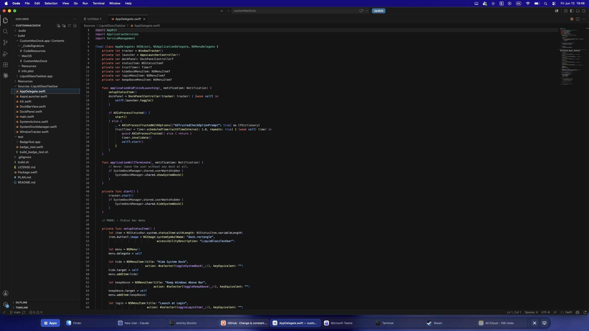

# LiquidGlassTaskbar

A Windows 7 style taskbar for macOS Tahoe — a full replacement for the system
Dock, rendered as a centered, content-hugging Liquid Glass pill using the
native Tahoe `glassEffect` APIs. With too many windows to fit, it expands to
the full width and scrolls.



If you switched from Windows and never got used to how the macOS Dock handles
windows and minimizing, this is for you:

- **One window = one taskbar button** (app icon + live window title)
- Clicking a button restores/focuses the window; clicking the **active**
  window's button minimizes it (the Win7 toggle)
- Minimized windows stay in the bar, just visually dimmed
- Apps without open windows don't appear at all
- **Pinning**: right-click a window → *Pin*. A pinned app stays in the bar
  after its windows close, as a dimmed app button — click to launch. Pinned
  apps sit at the start of the bar in pin order, and their windows appear at
  the pin position
- **Notification highlight**: when an app's dock badge appears or grows while
  the app is in the background, its buttons turn orange; activating the app
  clears it
- **Apps** button on the left opens the system "Apps" window of macOS Tahoe
  (Launchpad's replacement); right-click it for a built-in searchable app grid
- **Show Desktop** and **region screenshot (⇧⌘4)** buttons on the right
- **Fullscreen auto-hide**: on fullscreen Spaces the bar hides; move the
  cursor to the bottom screen edge to reveal it (Dock-like), move away to
  hide it again
- **Resizable**: hover a divider (the cursor turns into the up/down resize
  arrow) and drag vertically to grow or shrink the whole bar — icons, text,
  and the reserved zone all scale together. The size is remembered. Windows
  tiled *after* a resize honor the new height; already-tiled windows keep
  their size
- Right-click menu per window: New Window / Restore / Minimize / Close /
  Pin–Unpin / Hide / Quit

## Requirements

- macOS Tahoe (26.x) — the UI is built on Tahoe's Liquid Glass APIs and the
  Apps button targets Tahoe's `com.apple.apps.launcher`
- Swift toolchain (Command Line Tools are enough — no Xcode needed)

## Build & run

```sh
./build.sh
open build/LiquidGlassTaskbar.app
```

On first launch the app asks for **Accessibility** access
(System Settings → Privacy & Security → Accessibility). The bar populates
within a few seconds of granting it.

> **Code signing note:** the build script signs with a self-signed
> certificate named `LiquidGlassTaskbar Signing` if one exists in your keychain,
> so the Accessibility permission survives rebuilds. Without it, the build
> falls back to ad-hoc signing and macOS drops the permission on every
> rebuild (re-grant it, or reset with
> `tccutil reset Accessibility sk.michalek.LiquidGlassTaskbar`). To create the
> certificate: Keychain Access → Certificate Assistant → Create a
> Certificate → type "Code Signing", name it `LiquidGlassTaskbar Signing`.

## Status bar menu

The app lives in the menu bar (dock icon symbol):

- **Hide System Dock** — enables autohide with a 1000 s delay so the system
  Dock never slides out, and switches the minimize animation to `scale` +
  `minimize-to-application` so windows visually shrink into the bar.
  Everything is restored automatically when LiquidGlassTaskbar quits. Manual
  recovery, should you ever need it:
  ```sh
  defaults delete com.apple.dock autohide-delay
  defaults write com.apple.dock autohide -bool false
  defaults write com.apple.dock mineffect -string genie
  defaults write com.apple.dock minimize-to-application -bool false
  killall Dock
  ```
- **Keep Windows Above Bar** — windows that maximize or tile to the bottom
  screen edge (Tahoe's drag-to-top gesture, the green zoom button) are
  automatically resized to stop above the bar, like the Windows work area.
  macOS has no public API to reserve screen space, so this is enforced via
  Accessibility on window-resize events
- **Launch at Login** — via `SMAppService`
- **Refresh Window List** — forces a rescan (one also runs every 4 s as a
  safety net alongside real-time AX notifications)
- **Quit LiquidGlassTaskbar**

## How it works

Native Swift + AppKit/SwiftUI, no dependencies. Windows of other apps are
tracked through the Accessibility API (`AXUIElement` + `AXObserver`
notifications), app lifecycle through `NSWorkspace`, and the bar itself is a
borderless `NSPanel` above all Spaces. Three notable tricks:

- **Windows on other Spaces**: the AX API doesn't return windows on
  unvisited Spaces. The bar cross-references CGWindowList (which sees all
  Spaces) and shows an app-level button for apps whose real windows are
  AX-invisible; clicking activates the app, macOS switches to its Space, and
  the button becomes a proper per-window item. Once seen, windows are kept
  until actually destroyed.
- **Notification badges** are read from the AX tree of the hidden system
  Dock — macOS exposes other apps' notifications to third parties no other
  way. Banner-only notifications (no badge change) are not detected.
- **Launching/activating** apps goes through `open -b <bundle-id>`, which
  also handles apps with non-standard bundles (Steam registers a directory
  without an `.app` extension).

See [PLAN.md](PLAN.md) for the original design document.

## Known limitations

- The bar shows on the primary display only (multi-monitor support planned)
- Manually dragging a window's bottom edge under the bar is still possible —
  only maximize/tile-to-bottom resizes are corrected ("Keep Windows Above
  Bar")
- Fullscreen detection rides on the focused window's `AXFullScreen`
  attribute (plus a full-screen-coverage heuristic for borderless games) —
  exotic fullscreen modes may not be detected
- App-specific Dock menu items (e.g. Safari's "New Private Window") are a
  private channel between apps and the system Dock; the standard actions
  (New Window, Hide, Quit) are provided instead
- No hover window previews or drag-to-reorder yet

## Debugging

```sh
defaults write sk.michalek.LiquidGlassTaskbar diagnosticsRequested -bool true
# wait ~5 s
cat /tmp/LiquidGlassTaskbar-diag.txt
```

Dumps the full window-tracking state: every running app, its AX windows
(role/subrole/title), CG windows (layer/bounds), dock badges, and bar items.

To test the notification highlight: `test/build_badge_test.sh && open
test/BadgeTest.app` — it sets its own badge 10 s after launch.

## Uninstall

Quit the app (the system Dock restores automatically), delete the app and:

```sh
defaults delete sk.michalek.LiquidGlassTaskbar
tccutil reset Accessibility sk.michalek.LiquidGlassTaskbar
```

## License

Copyright (c) 2026 Andrej Michalek

Licensed under the [PolyForm Noncommercial License 1.0.0](LICENSE.md) —
free to use, modify, and share for any noncommercial purpose (personal use,
research, education, nonprofits). Commercial use requires a separate license
from the author.
